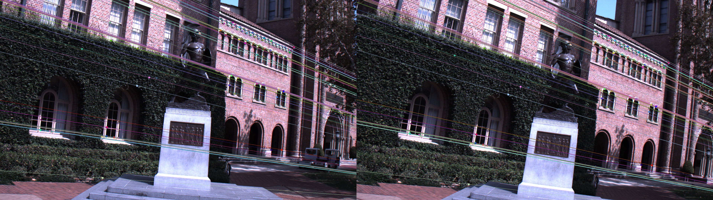
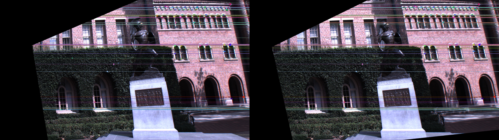
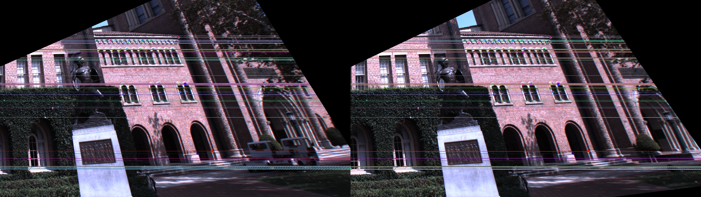

# 📝 uncalibrated stereo rectification #
***

- original pair of images



- rectified images by method implemented in opencv (Hartley et al.'s method)



- rectified images by loop&zhang's method:



**could not find Loop et al.'s original implementation so I implemented my own way of additional uniform scaling and translation after rectification.**

## :tada: TODO ##
***

- [x] Implementation of uncalibrated rectification method presented in [Computing Rectifying Homographies for Stereo Vision](http://dev.ipol.im/~morel/Dossier_MVA_2011_Cours_Transparents_Documents/2011_Cours7_Document2_Loop-Zhang-CVPR1999.pdf)
- [ ] Implementation of [DSR method](https://arxiv.org/pdf/1809.09763.pdf)

## 🎛  Dependencies ##
***

```bash
python setup.py install --record files.txt
```

- conda environment

```bash
conda env create --file environment.yml
conda activate stereo_rectification
```

## :running: How to Run ##
***

```bash
python scripts/test_stereo_rectification.py --left_image_path LEFT_IMAGE_PATH --right_image_path RIGHT_IMAGE_PATH

# eg: python scripts/test_stereo_rectification.py --left_image_path ./data/TOMMY2_L.png --right_image_path ./data/TOMMY2_R.png
```

*the pair of images used here are from [MCL SS Database](http://mcl.usc.edu/mcl-ss-database/)*

## :gem: References ##
***

- [Theory and Practice of Projective Rectification](https://link.springer.com/article/10.1023/A:1008115206617)
- [Computing Rectifying Homographies for Stereo Vision, CVPR 1999](http://dev.ipol.im/~morel/Dossier_MVA_2011_Cours_Transparents_Documents/2011_Cours7_Document2_Loop-Zhang-CVPR1999.pdf)
- [DSR: Direct Self-rectification for Uncalibrated Dual-lens Cameras](https://arxiv.org/pdf/1809.09763.pdf)
